# API de Seguros e Planos de Aposentadoria

Este projeto consiste em uma API desenvolvida com FastAPI para gerenciar seguros e planos de aposentadoria.

## Requisitos

- Python 3.12+
- Poetry para gerenciamento de dependências
- SQLite como banco de dados local

## Como usar

### Clonar o repositório

git clone <URL_DO_REPOSITORIO>
cd app_local_tdd

## Configurar o ambiente

1. Instale o Poetry:

    pip install poetry

2. Instale as dependências:

    poetry install

3. Ative o ambiente virtual:

    poetry shell

## Executar o servidor

Para iniciar o servidor, execute:

poetry run uvicorn store.main:app --reload

A API estará disponível em <http://127.0.0.1:8000>.

## Endpoints disponíveis

    /insurance/: Lista de seguros fictícios.
    /retirement/: Lista de planos de aposentadoria fictícios.

## Documentação da API

1. Swagger UI
2. ReDoc

## Estrutura do projeto

    app_local_tdd/
    ├── store/
    │   ├── controllers/
    │   │   ├── insurance.py
    │   │   └── retirement.py
    │   ├── core/
    │   │   ├── config.py
    │   │   └── database.py
    │   ├── models/
    │   ├── routers/
    │   │   └── __init__.py
    │   ├── main.py
    ├── README.md
    ├── pyproject.toml
    ├── .gitignore

## Imagens do Desenvolvimento do Projeto

Abaixo estão as imagens capturadas durante o desenvolvimento do projeto:

### 1. Configuração do Ambiente Virtual

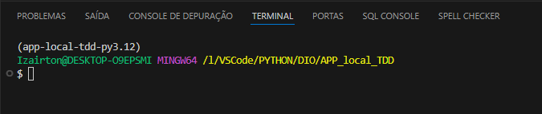

### 2. Ativação do Ambiente Virtual Local

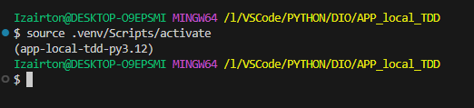

### 3. Configuração das Bibliotecas

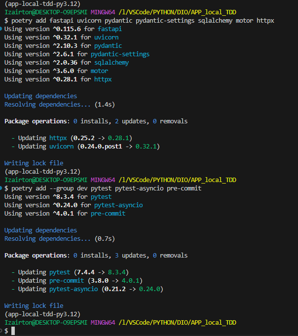

### 4. Estrutura do Projeto

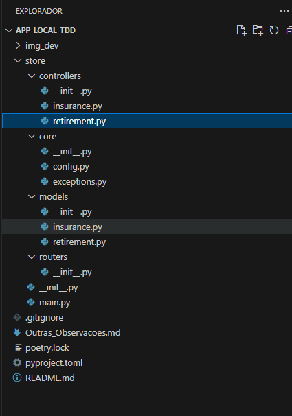

### 5. Instalação das Bibliotecas com Poetry

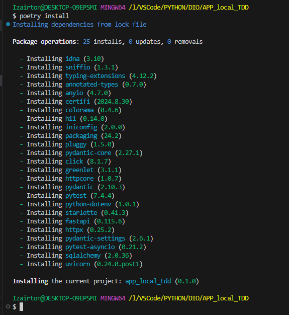

### 6. Ambiente Virtual no Python

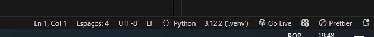

### 7. Gerando o `poetry.lock`

### 8. Script de Criação da Estrutura

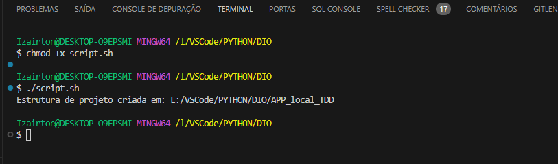

### 9. Mensagem de Boas-Vindas no Servidor

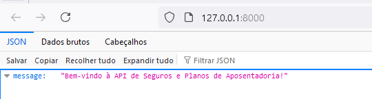

### 10. Documentação da API

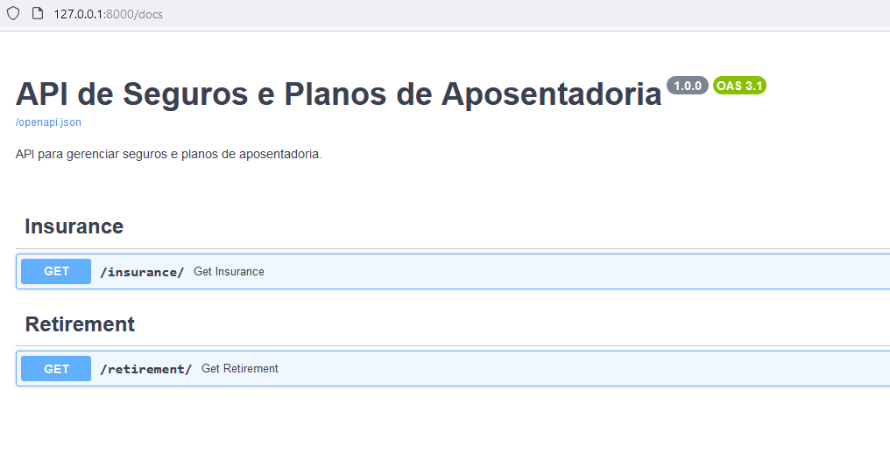

### 11. Endpoint `/insurance`

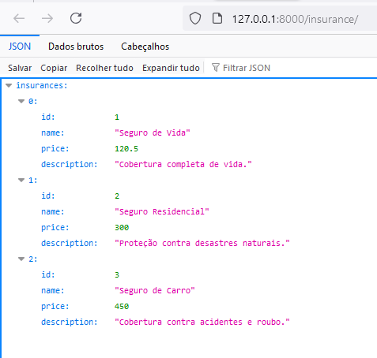

### 12. Endpoint `/retirement`

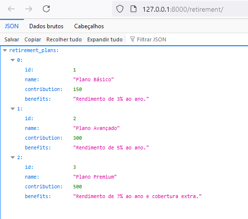

## Contribuindo

Sinta-se à vontade para abrir issues ou enviar pull requests. Feedbacks e melhorias são sempre bem-vindos!

## Licença

MIT
